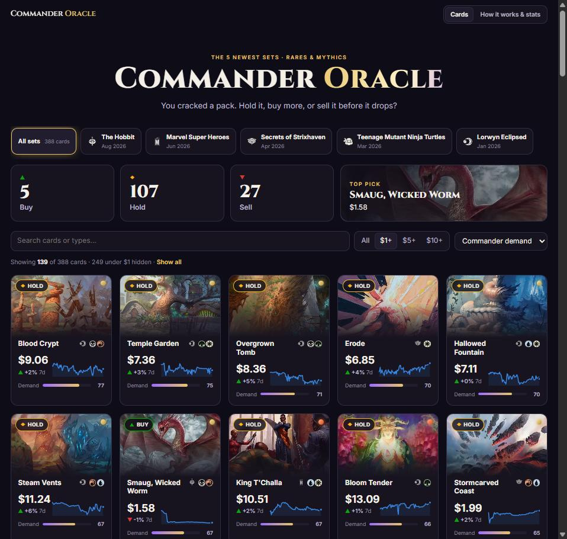

# Commander Oracle

**You cracked a pack. Should you hold it, buy more, or sell it before it drops?**

Commander Oracle ranks the rares and mythics from the five newest Magic: The Gathering
expansions by their long-term **Commander** demand, and gives each card a Buy / Hold / Sell
outlook. It combines daily price history, real EDHREC deck counts, and a set of
judgments from [TypeSafe's Jev](https://docs.typesafe.ai) that read each card's
rules text the way a Commander player would.



> **Probabilities, not promises.** This is a hobby project and not financial advice.
> The outlook weights are a starting guess and haven't been backtested yet (see
> [Roadmap](#roadmap)). Nobody can reliably predict card prices, and this doesn't
> claim to.

## Why Commander?

Most cards from a new set crash 60–90% from their preorder price within a few weeks.
Tournament play drives short spikes, but what keeps a card's price up over the long
run is Commander, the format most casual players actually play. A card that fits
into thousands of Commander decks holds its value. A card that only works with its
own set's mechanics usually doesn't.

So the question the app asks is: **how many Commander players will want this card
a year from now?**

## How it works

```
Scryfall ──► card data, rules text, images ─┐
MTGJSON  ──► ~90 days of daily prices ──────┼──► oracle.build ──► cards.json
EDHREC   ──► Commander deck counts ─────────┘                         │
                                                                      ▼
                           Jev reads the rules text ──► oracle.judge (adds judgments + outlook)
                                                                      │
                                                                      ▼
                                                          web/ (React + Vite)
```

**Jev judges, code decides.** Jev is a "System One" model. It doesn't write text;
it returns typed answers and calibrated probabilities. For each card it answers
four narrow questions, looking at **only the rules text**:

| Question | Type | What it captures |
|---|---|---|
| Deck breadth | Score | Does it fit nearly every deck in its colors, or one narrow tribe? |
| Power | Score | Is it strong for its cost at a Commander table? |
| Build-around commander | Yes/No probability | Will players build whole decks around it? |
| Set-locked | Yes/No probability | Does it only work with this set's mechanics? |

Prices and EDHREC numbers are deliberately **kept out** of what Jev sees. That makes
each judgment an independent signal that can be tested against what prices
actually did. It isn't just an echo of the numbers.

Code then combines Jev's judgments with the facts (EDHREC inclusion rate, drawdown
from peak, week-over-week trend, dealer buylist strength) into a demand score and a
verdict. The weights live in one file, [`oracle/outlook.py`](oracle/outlook.py), and
Jev's answers are cached, so re-tuning costs nothing.

## Run it yourself

You need Python 3.11+, Node 20+, and a TypeSafe API key from
[console.typesafe.ai](https://console.typesafe.ai/).

```sh
git clone https://github.com/kitapplegate/commander-oracle
cd commander-oracle

python -m venv .venv
.venv/Scripts/activate          # Windows; use `source .venv/bin/activate` on macOS/Linux
pip install -r requirements.txt

cp .env.example .env            # then paste your TYPESAFE_API_KEY into .env

python -m oracle.daily --refresh   # card list + today's prices into data/universe.sqlite
python -m oracle.daily --backfill  # ~90 days of price history
python -m oracle.build            # the 5 newest expansions (or pass set codes)
python -m oracle.judge          # asks Jev about each card, adds the outlook

cd web
npm install
npm run dev                     # http://localhost:5173
```

The first build takes about 6 minutes, almost all of it EDHREC lookups throttled to one
per second. After that everything is cached.

## Data sources and thanks

- **[Scryfall](https://scryfall.com)**: card data and images. Images are hotlinked
  per Scryfall's guidelines, never rehosted.
- **[MTGJSON](https://mtgjson.com)**: daily TCGplayer and Card Kingdom prices.
- **[EDHREC](https://edhrec.com)**: Commander deck counts. This uses EDHREC's public
  JSON, which is unofficial; requests are cached for 3 days and throttled to one per
  second. Please keep it that way if you fork this.
- **[TypeSafe](https://typesafe.ai)**: the Jev model.

## Roadmap

- [ ] **Backtest.** Run the same pipeline on an older set as of ~60 days after its
      release, then compare the verdicts against what prices actually did. Only
      signals that beat a naive baseline keep their weight.
- [x] The five newest sets, with a set picker. A new release rotates in automatically.
- [x] Daily price pipeline and site refresh on a server (see `deploy/`).
- [ ] Reprint-risk and ban-news signals: Jev reading announcements and
      r/mtgfinance posts.

## License

Code is [MIT](LICENSE).

Commander Oracle is unofficial Fan Content permitted under the
[Fan Content Policy](https://company.wizards.com/en/legal/fancontentpolicy). Not
approved/endorsed by Wizards. Portions of the materials used are property of Wizards
of the Coast. ©Wizards of the Coast LLC. Card names, text, and artwork belong to
Wizards of the Coast and their respective artists.
